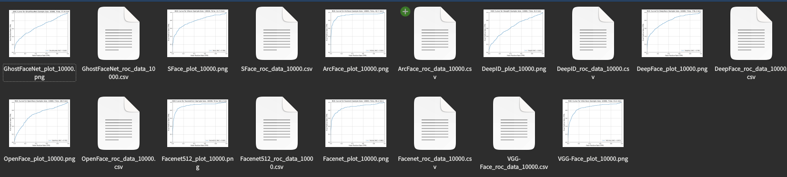

# フリーの事前顔学習済み顔学習モデル11種の精度評価

## はじめに
日本の企業や大学が顔認証を実装する時、事前学習されているフリーの顔学習モデルを探すと思います。

この記事ではこれらのうち学習モデルを公開しているGitHubリポジトリを対象として、各学習モデルのAUCスコア・ROC曲線を描画し評価しました。

評価にあたり、対象となる顔データセットをこちらで用意しました。日本人を対象とした顔認証（顔照合）を想定して、日本人若年女性のデータセットとしました。[^1]
[^1]:約300枚用意しましたが、総組み合わせペアは膨大になるため、ランダムにペアを作り評価する方式を採用しています。（コードをご参照ください） この顔画像データセットで学習はしていません。

公開されている各顔学習モデルの精度および照合にかかる時間を調査されている方は参考にしてください。


## 最初に結論


## 環境
:::details 評価用ホスト環境
```
# Python仮想環境
$ python -V
Python 3.10.12

# システム
$ inxi -SG --filter
System:
  Kernel: 6.8.0-50-generic x86_64 bits: 64 Desktop: GNOME 42.9
    Distro: Ubuntu 22.04.5 LTS (Jammy Jellyfish)
Graphics:
  Device-1: NVIDIA TU116 [GeForce GTX 1660 Ti] driver: nvidia v: 555.42.06
  Display: x11 server: X.Org v: 1.21.1.4 driver: X: loaded: nouveau
    unloaded: fbdev,modesetting,vesa failed: nvidia gpu: nvidia
    resolution: 2560x1440~60Hz
  OpenGL: renderer: NVIDIA GeForce GTX 1660 Ti/PCIe/SSE2
    v: 4.6.0 NVIDIA 555.42.06
```
:::

## 方針
この記事で評価するフリーの事前顔学習済みモデルは以下の11種類です。
- VGG-Face
- FaceNet
- OpenFace
- DeepFace
- DeepID
- ArcFace
- Dlib
- SFace
- GhostFaceNe
- dlib
- JAPANESE FACE V1

使用したリポジトリは以下の2つです。

https://github.com/serengil/deepface

https://github.com/yKesamaru/FACE01_DEV

## 実装
### deepfaceリポジトリ
参考: [DeepFace: A Facial Recognition Library for Python](https://www.youtube.com/watch?v=WnUVYQP4h44)

deepfaceリポジトリは（わたしの環境では）そのままではGPUを利用できませんでしたので修正が必要です。以下の記事に方法・手順を記載しましたので参考にしてください。

deepFace:独自DockerコンテナでGPUから利用する
https://zenn.dev/ykesamaru/articles/38329e86116f2b

#### Dockerfile
:::details deepface用Dockerfile
# base image
FROM python:3.8.12
LABEL org.opencontainers.image.source https://github.com/serengil/deepface

# -----------------------------------
# create required folder
RUN mkdir -p /app && chown -R 1001:0 /app
RUN mkdir -p /app/deepface
RUN mkdir -p /root/.deepface/weights  # weightsフォルダのコピー先を作成

# -----------------------------------
# switch to application directory
WORKDIR /app

# -----------------------------------
# update image OS and install system dependencies
RUN apt-get update && apt-get install -y \
    ffmpeg \
    libsm6 \
    libxext6 \
    libhdf5-dev \
    wget \
    && rm -rf /var/lib/apt/lists/*

# -----------------------------------
# Install CUDA and cuDNN
RUN distribution=$( . /etc/os-release; echo $ID$VERSION_ID) && \
    wget https://developer.download.nvidia.com/compute/cuda/repos/$distribution/x86_64/cuda-keyring_1.0-1_all.deb && \
    dpkg -i cuda-keyring_1.0-1_all.deb && \
    apt-get update && \
    apt-get install -y cuda-toolkit-11-5 libcudnn8 libcudnn8-dev libcublas-12-0 && \
    rm -rf /var/lib/apt/lists/*

# Set CUDA environment variables
ENV PATH=/usr/local/cuda-11.5/bin${PATH:+:${PATH}}
ENV LD_LIBRARY_PATH=/usr/local/cuda-11.5/lib64${LD_LIBRARY_PATH:+:${LD_LIBRARY_PATH}}

# -----------------------------------
# Copy required files from repo into image
COPY ./deepface /app/deepface
COPY ./requirements.txt /app/requirements.txt
COPY ./requirements_local /app/requirements_local.txt
COPY ./package_info.json /app/
COPY ./setup.py /app/
COPY ./README.md /app/
COPY ./entrypoint.sh /app/deepface/api/src/entrypoint.sh

# Copy weights folder into container
COPY ./weights /root/.deepface/weights

# -----------------------------------
# install dependencies - deepface with these dependency versions is working
RUN pip install --trusted-host pypi.org --trusted-host pypi.python.org --trusted-host=files.pythonhosted.org -r /app/requirements_local.txt
# install deepface from source code (always up-to-date)
RUN pip install --trusted-host pypi.org --trusted-host pypi.python.org --trusted-host=files.pythonhosted.org -e .

# Install TensorFlow compatible with CUDA setup
RUN pip uninstall -y tensorflow keras && \
    pip install --no-cache-dir tensorflow==2.12 && \
    pip install matplotlib && \
    pip install scikit-learn

# -----------------------------------
# environment variables
ENV PYTHONUNBUFFERED=1

# -----------------------------------
# set working directory for runtime
WORKDIR /app/deepface
:::

#### 事前顔学習モデル評価コード
:::details deepface_auc_roc_random_sampling.py
```python: deepface_auc_roc_random_sampling.py
"""deepface_auc_roc_random_sampling.py.

Summary:
    このスクリプトは、DeepFaceライブラリを使用して複数の顔認証モデルの性能を評価し、
    ROC曲線とAUCスコアをプロットします。特定の顔画像データセットを使用し、ランダムサンプリングを行いながら、
    異なるモデル間での類似性判定精度を比較する目的で設計されています。

    - 指定された顔画像ディレクトリ内の画像をランダムにペアリングし、同一人物かどうかのラベルを生成。
    - DeepFaceライブラリを利用して、複数のモデルで顔画像ペア間の距離を計算。
    - 各モデルごとにROC曲線をプロットし、AUCスコアと処理時間を表示して画像ファイルに保存。
    - ROC曲線の描画に必要なデータをCSV形式で保存。

Note:
    - スクリプトは画像名から人物名を抽出し、同一人物ラベルを作成します。ファイル名の命名規則に依存するため、
      必要に応じて `extract_person_name` 関数を修正してください。
    - サンプルサイズを調整することで計算負荷をコントロールできます。

License:
    This script is licensed under the terms provided by yKesamaru, the original author.
"""

import itertools
import os
import random
import time
import csv
from typing import List, Tuple

import matplotlib.pyplot as plt
from deepface import DeepFace
from sklearn.metrics import auc, roc_curve

def extract_person_name(file_path: str) -> str:
    """
    指定したファイルパスから人物名を抽出して返す関数。

    Args:
        file_path (str): ファイルへのパス。

    Returns:
        str: 抽出した人物名。

    Example:
        >>> extract_person_name("example_image_001.png")
        "example"

    Note:
        ファイル名の命名規則に依存しているため、必要に応じて修正してください。

    """
    filename = os.path.basename(file_path)
    parts = filename.split('_')
    return parts[0] if parts else ""

def get_sampled_image_label_pairs(image_dir: str, sample_size: int) -> List[Tuple[str, str, int]]:
    """
    ランダムにサンプリングした画像ペアを生成し、ラベルを付加する関数。

    Args:
        image_dir (str): 画像が格納されたディレクトリへのパス。
        sample_size (int): サンプリングするペアの数。

    Returns:
        List[Tuple[str, str, int]]: サンプリングされた(画像パス1, 画像パス2, ラベル)のリスト。

    Example:
        >>> get_sampled_image_label_pairs("images", 100)
        [("img1.png", "img2.png", 1), ...]

    Note:
        サンプリングするペアの数は、全ペア数を超えることはありません。

    """
    image_paths = [os.path.join(image_dir, f) for f in os.listdir(image_dir) if f.endswith(".png")]
    all_pairs = list(itertools.combinations(image_paths, 2))

    sampled_pairs = random.sample(all_pairs, min(sample_size, len(all_pairs)))

    pair_list = []
    for img1, img2 in sampled_pairs:
        person1 = extract_person_name(img1)
        person2 = extract_person_name(img2)
        label = 1 if person1 == person2 else 0
        pair_list.append((img1, img2, label))

    print(f"Total sampled pairs: {len(pair_list)}")
    return pair_list

def calculate_distances_for_model(
    pairs: List[Tuple[str, str, int]],
    model_name: str,
    enforce_detection: bool = False,
    align: bool = False
) -> Tuple[List[float], List[int]]:
    """
    指定したDeepFaceモデルを使用して画像ペアの距離を計算する関数。

    Args:
        pairs (List[Tuple[str, str, int]]): 画像ペアとラベルのリスト。
        model_name (str): DeepFaceで使用するモデル名。
        enforce_detection (bool): 顔検出を強制するかどうか。デフォルトはFalse。
        align (bool): 顔画像のアライメントを行うかどうか。デフォルトはFalse。

    Returns:
        Tuple[List[float], List[int]]: 計算された距離と対応するラベルのタプル。

    Example:
        >>> calculate_distances_for_model(pairs, "VGG-Face")
        ([0.5, 0.6, ...], [1, 0, ...])

    Note:
        DeepFaceのモデル名は事前にサポートされている必要があります。

    """
    distances = []
    labels = []

    for img1, img2, label in pairs:
        try:
            result = DeepFace.verify(
                img1_path=img1,
                img2_path=img2,
                model_name=model_name,
                enforce_detection=enforce_detection,
                align=align
            )
            distances.append(result["distance"])
            labels.append(label)
        except Exception as e:
            print(f"Error comparing {img1} and {img2} with model={model_name}: {e}")

    return distances, labels

def save_roc_data_to_csv(
    model_name: str,
    fpr: List[float],
    tpr: List[float],
    thresholds: List[float],
    sample_size: int,
    elapsed_time: float
) -> None:
    """
    ROC曲線に必要なデータをCSVファイルに保存する関数。

    Args:
        model_name (str): モデル名。
        fpr (List[float]): False Positive Rate のリスト。
        tpr (List[float]): True Positive Rate のリスト。
        thresholds (List[float]): スレッショルド値のリスト。
        sample_size (int): サンプリングされたペアの数。
        elapsed_time (float): 処理にかかった時間（秒単位）。

    Example:
        >>> save_roc_data_to_csv("VGG-Face", [0.0, 0.1], [0.0, 0.8], [1.0, 0.5], 10000, 678.45)

    Note:
        ファイル名にはモデル名とサンプルサイズが含まれます。

    """
    output_file = f"{model_name}_roc_data_{sample_size}.csv"
    with open(output_file, mode="w", newline="", encoding="utf-8") as file:
        writer = csv.writer(file)
        writer.writerow(["FPR", "TPR", "Threshold", "SampleSize", "ElapsedTime"])
        for row in zip(fpr, tpr, thresholds):
            writer.writerow(list(row) + [sample_size, elapsed_time])

    print(f"Saved ROC data for {model_name} as {output_file}")

def plot_roc_curve(
    model_name: str,
    distances: List[float],
    labels: List[int],
    sample_size: int,
    elapsed_time: float
) -> None:
    """
    特定のモデルに対してROC曲線をプロットし、画像ファイルとして保存する関数。

    Args:
        model_name (str): モデル名。
        distances (List[float]): 計算された距離のリスト。
        labels (List[int]): 対応するラベルのリスト。
        sample_size (int): サンプリングされたペアの数。
        elapsed_time (float): 処理にかかった時間（秒単位）。

    Example:
        >>> plot_roc_curve("VGG-Face", [0.5, 0.6], [1, 0], 100, 678.45)

    Note:
        グラフはモデルごとに個別のファイルに保存されます。

    """
    plt.figure(figsize=(8, 6))

    scores = [-d for d in distances]
    fpr, tpr, thresholds = roc_curve(labels, scores, pos_label=1)
    roc_auc = auc(fpr, tpr)

    # ROCデータをCSVに保存
    save_roc_data_to_csv(model_name, fpr, tpr, thresholds, sample_size, elapsed_time)

    plt.plot(fpr, tpr, label=f"{model_name} (AUC = {roc_auc:.3f})")
    plt.xlim([0.0, 1.0])
    plt.ylim([0.0, 1.0])
    plt.xlabel("False Positive Rate (FPR)", fontsize=12)
    plt.ylabel("True Positive Rate (TPR)", fontsize=12)
    plt.title(f"ROC Curve for {model_name} (Sample Size: {sample_size}, Time: {elapsed_time / 60:.1f} min)", fontsize=14)
    plt.legend(loc="lower right")
    plt.grid(True)

    output_file = f"{model_name}_plot_{sample_size}.png"
    plt.savefig(output_file, dpi=300, bbox_inches="tight")
    plt.close()

    print(f"Saved ROC curve for {model_name} as {output_file}")

def main():
    """
    DeepFaceを使用して顔認証モデルの評価を実施するメイン関数。

    Summary:
        - ランダムサンプリングされた画像ペアを生成。
        - DeepFaceライブラリを使用して複数モデルでの評価を実行。
        - 各モデルごとにROC曲線をプロットして保存。
        - ROCデータをCSV形式で保存。

    Note:
        使用する画像データセットのパスとサンプルサイズを調整可能です。

    """
    image_dir = "assets/若年日本人女性"
    sample_size = 10000

    print("Sampling image pairs...")
    pairs = get_sampled_image_label_pairs(image_dir, sample_size)

    models = [
        "VGG-Face",
        "Facenet",
        "Facenet512",
        "OpenFace",
        "DeepFace",
        "DeepID",
        # "Dlib",
        "ArcFace",
        "SFace",
        "GhostFaceNet"
    ]

    for model in models:
        print(f"Processing model: {model}...")
        start_time = time.time()
        distances, labels = calculate_distances_for_model(pairs, model)
        elapsed_time = time.time() - start_time
        if distances and labels:
            plot_roc_curve(model, distances, labels, sample_size, elapsed_time)

if __name__ == "__main__":
    main()

```
:::

#### 実行結果


### JAPANESE FACE V1リポジトリ
[tokaikaoninsho/face01_gpu](https://hub.docker.com/r/tokaikaoninsho/face01_gpu)からpullしてください。
```bash
docker pull tokaikaoninsho/face01_gpu
```
```bash: その他のコマンド
# ビルド
docker build --network host --no-cache -face01_gpu -gpu .
# コンテナ起動
docker run -it \
    --gpus all -e DISPLAY=$DISPLAY --network host \
    -v /tmp/.X11-unix:/tmp/.X11-unix \
    -v /home/user/ドキュメント/github_face_recognition_comparison:/home/docker/test \
    1c63aae7b15d
# 仮想環境をアクティベート
. bin/activate
# 評価用のライブラリをインストールしておく
pip install scikit-learn
```
#### 事前顔学習モデル評価コード
:::details python: dlib_japanesefacev1_auc_roc_random_sampling.py
```python: dlib_japanesefacev1_auc_roc_random_sampling.py
"""dlib_japanesefacev1_auc_roc_random_sampling.py.

Summary:
    このスクリプトは、dlibとJAPANESE FACE V1(JAPANESE_FACE_V1.onnx)を使用して
    顔認証モデルの性能を評価し、ROC曲線とAUCスコアをプロットします。
    具体的には以下の処理を行います。

    - 指定された顔画像ディレクトリ内の画像をランダムにペアリングし、同一人物かどうかのラベルを生成。
    - dlibおよびONNXモデル(JAPANESE FACE V1)を用いて、各ペアの距離または類似度を計算。
    - 各モデルごとにROC曲線(AUC含む)をプロットし、画像ファイルに保存。
    - ROC曲線の描画に必要なデータをCSV形式で保存。
    - 処理時間を計測し、サンプル数やAUC等とともに出力。
"""

import os
import csv
import time
import random
import itertools
from typing import List, Tuple

import dlib
import onnx
import onnxruntime as ort
import numpy as np
from PIL import Image
import torchvision.transforms as transforms
import matplotlib.pyplot as plt
from sklearn.metrics import auc, roc_curve

# ================================
# ディレクトリ設定
# ================================
# 実行時のカレントディレクトリが「~/FACE01_DEV」想定。
# モデルファイルが置かれているディレクトリ
MODEL_DIR = os.path.join("..", "test", "assets", "models")
# 画像が格納されているディレクトリ
IMAGE_DIR = os.path.join("..", "test", "assets", "若年日本人女性")

# ================================
# モデルの準備
# ================================
# -- dlibのモデルをロード --
shape_predictor_path = os.path.join(MODEL_DIR, "shape_predictor_5_face_landmarks.dat")
face_recognition_model_path = os.path.join(MODEL_DIR, "dlib_face_recognition_resnet_model_v1.dat")

# HOGベース
# face_detector = dlib.get_frontal_face_detector()  # 顔検出器(HOGベース)
shape_predictor = dlib.shape_predictor(shape_predictor_path)
face_recognition_model = dlib.face_recognition_model_v1(face_recognition_model_path)

# CNNベースの顔検出を使う場合は、以下を利用してください(コメントアウトを解除・置き換え):
cnn_face_detector_path = os.path.join(MODEL_DIR, "mmod_human_face_detector.dat")
cnn_face_detector = dlib.cnn_face_detection_model_v1(cnn_face_detector_path)
# ※ CNNベース使用時は、検出結果が "d.rect" でアクセス可能

# -- JAPANESE FACE V1 のモデルをロード --
onnx_model_path = os.path.join(MODEL_DIR, "JAPANESE_FACE_V1.onnx")
onnx_model = onnx.load(onnx_model_path)
ort_session = ort.InferenceSession(onnx_model_path)
input_name = onnx_model.graph.input[0].name

# ================================
# 画像前処理の定義 (JAPANESE FACE V1用)
# ================================
mean_value = [0.485, 0.456, 0.406]
std_value = [0.229, 0.224, 0.225]
transform = transforms.Compose([
    transforms.Resize((224, 224)),   # 画像を224x224にリサイズ
    transforms.ToTensor(),           # テンソル化
    transforms.Normalize(            # 正規化
        mean=mean_value,
        std=std_value
    )
])

# ================================
# ユーティリティ関数
# ================================
def extract_person_name(file_path: str) -> str:
    """
    指定したファイルパスから人物名を抽出して返す関数。
    ファイル名に「人物名_〇〇.png」という形式を想定。

    Args:
        file_path (str): ファイルへのパス。

    Returns:
        str: 抽出した人物名。
    """
    filename = os.path.basename(file_path)  # 例: "Alice_01.png"
    parts = filename.split('_')
    return parts[0] if parts else ""

def get_sampled_image_label_pairs(image_dir: str, sample_size: int) -> List[Tuple[str, str, int]]:
    """
    ランダムにサンプリングした画像ペアを生成し、ラベル(同一人物=1, 別人=0)を付加する関数。

    Args:
        image_dir (str): 画像が格納されたディレクトリへのパス。
        sample_size (int): サンプリングするペアの数。

    Returns:
        List[Tuple[str, str, int]]: サンプリングされた(画像パス1, 画像パス2, ラベル)のリスト。
    """
    # ディレクトリ内の.pngファイルをすべて取得
    image_paths = [os.path.join(image_dir, f) for f in os.listdir(image_dir) if f.endswith(".png")]

    if not image_paths:
        print(f"[Warning] No PNG files found in {image_dir}")
        return []

    # 全ペアを作成
    all_pairs = list(itertools.combinations(image_paths, 2))

    # ランダムに sample_size 件だけ選択
    sampled_pairs = random.sample(all_pairs, min(sample_size, len(all_pairs)))

    pair_list = []
    for img1, img2 in sampled_pairs:
        person1 = extract_person_name(img1)
        person2 = extract_person_name(img2)
        label = 1 if person1 == person2 else 0
        pair_list.append((img1, img2, label))

    print(f"Total sampled pairs: {len(pair_list)}")
    return pair_list

def get_embedding_dlib(image_path: str) -> np.ndarray:
    """
    画像ファイルからdlibの埋め込みベクトル(128次元)を取得する関数。

    Args:
        image_path (str): 画像パス。

    Returns:
        np.ndarray or None: 128次元の埋め込みベクトル。顔が検出できなかった場合は None を返す。
    """
    image = dlib.load_rgb_image(image_path)
    # HOGベースを使うなら下記をコメントインして置き換え
    # detected_faces = face_detector(image, 1)
    # if len(detected_faces) == 0:
    #     return None

    # CNNベース
    detected_faces = cnn_face_detector(image, 1)
    if len(detected_faces) == 0:
        return None
    d = detected_faces[0].rect

    # shape = shape_predictor(image, detected_faces[0])  # hog利用（CPU）
    shape = shape_predictor(image, d)                  # cnn利用（GPU）
    face_descriptor = face_recognition_model.compute_face_descriptor(image, shape)
    return np.array(face_descriptor)

def get_embedding_jface(image_path: str) -> np.ndarray:
    """
    画像ファイルからJAPANESE FACE V1 (JAPANESE_FACE_V1.onnx)の埋め込みベクトルを取得する関数。

    Args:
        image_path (str): 画像パス。

    Returns:
        np.ndarray: モデルが出力する埋め込みベクトル(Numpy配列)。
    """
    image = Image.open(image_path).convert("RGB")
    image = transform(image)
    image = image.unsqueeze(0).numpy()  # バッチ次元を作り numpy 配列へ

    # ONNXモデルで推論
    embedding = ort_session.run(None, {input_name: image})[0]
    return embedding

def calculate_distances_for_model(
    pairs: List[Tuple[str, str, int]],
    model_type: str,
) -> Tuple[List[float], List[int]]:
    """
    指定したモデルタイプ(dlib or japanese_face)で画像ペアのスコアを計算する関数。

    Args:
        pairs (List[Tuple[str, str, int]]): (画像パス1, 画像パス2, ラベル)のリスト。
        model_type (str): "dlib" または "japanese_face"。

    Returns:
        Tuple[List[float], List[int]]: 計算されたスコア(distances or similarities)のリストとラベルのリスト。
    """
    scores = []
    labels = []

    for (img1, img2, label) in pairs:
        if model_type == "dlib":
            emb1 = get_embedding_dlib(img1)
            emb2 = get_embedding_dlib(img2)
            if emb1 is None or emb2 is None:
                continue  # 顔が検出できなかった場合はスキップ
            # ユークリッド距離
            dist = np.linalg.norm(emb1 - emb2)
            scores.append(dist)
            labels.append(label)

        elif model_type == "japanese_face":
            emb1 = get_embedding_jface(img1)
            emb2 = get_embedding_jface(img2)
            if emb1 is None or emb2 is None:
                continue
            # 余弦類似度 (NumPyベース)
            emb1_flat = emb1.flatten()
            emb2_flat = emb2.flatten()
            cos_sim = np.dot(emb1_flat, emb2_flat) / (
                np.linalg.norm(emb1_flat) * np.linalg.norm(emb2_flat)
            )
            scores.append(float(cos_sim))
            labels.append(label)

        else:
            print(f"Unknown model type: {model_type}")
            return [], []

    return scores, labels

def save_roc_data_to_csv(
    model_type: str,
    fpr: List[float],
    tpr: List[float],
    thresholds: List[float],
    sample_size: int,
    elapsed_time: float
) -> None:
    """
    ROC曲線に必要なデータをCSVファイルに保存する関数。

    Args:
        model_type (str): モデル種別(dlib, japanese_faceなど)。
        fpr (List[float]): False Positive Rate のリスト。
        tpr (List[float]): True Positive Rate のリスト。
        thresholds (List[float]): スレッショルド値のリスト。
        sample_size (int): サンプリングされたペアの数。
        elapsed_time (float): 処理にかかった時間（秒）。
    """
    # 保存先を ../test ディレクトリに指定
    output_path = os.path.join("..", "test", f"{model_type}_roc_data_{sample_size}.csv")
    with open(output_path, mode="w", newline="", encoding="utf-8") as file:
        writer = csv.writer(file)
        writer.writerow(["FPR", "TPR", "Threshold", "SampleSize", "ElapsedTime"])
        for row in zip(fpr, tpr, thresholds):
            writer.writerow(list(row) + [sample_size, elapsed_time])

    print(f"Saved ROC data for {model_type} as {output_path}")

def plot_roc_curve(
    model_type: str,
    scores: List[float],
    labels: List[int],
    sample_size: int,
    elapsed_time: float,
    distance_based: bool = True
) -> None:
    """
    指定したモデルに対してROC曲線をプロットし、画像ファイルとして保存する関数。

    Args:
        model_type (str): モデル種別(dlib, japanese_faceなど)。
        scores (List[float]): 距離または類似度のリスト。
        labels (List[int]): 対応するラベル(1 or 0)のリスト。
        sample_size (int): サンプリングされたペアの数。
        elapsed_time (float): 処理にかかった時間（秒）。
        distance_based (bool): スコアが「距離ベース」の場合はTrue、「類似度ベース」の場合はFalse。
    """
    plt.figure(figsize=(10, 10))

    if distance_based:
        # dlibは距離が小さいほど類似度が高い -> スコアを負にしてROCを描画
        scores_for_roc = [-s for s in scores]
    else:
        # japanese_faceは余弦類似度が大きいほど類似度が高い -> スコアはそのまま
        scores_for_roc = scores

    fpr, tpr, thresholds = roc_curve(labels, scores_for_roc, pos_label=1)
    roc_auc = auc(fpr, tpr)

    # ROCデータをCSVに保存
    save_roc_data_to_csv(model_type, fpr, tpr, thresholds, sample_size, elapsed_time)

    plt.plot(fpr, tpr, label=f"{model_type} (AUC = {roc_auc:.3f})")
    plt.xlim([0.0, 1.0])
    plt.ylim([0.0, 1.0])
    plt.xlabel("False Positive Rate (FPR)", fontsize=12)
    plt.ylabel("True Positive Rate (TPR)", fontsize=12)
    plt.title(f"ROC Curve for {model_type}\n"
              f"(Sample Size: {sample_size}, Time: {elapsed_time / 60:.1f} min)",
              fontsize=14)
    plt.legend(loc="lower right")
    plt.grid(True)

    # 保存先を ../test ディレクトリに指定
    output_path = os.path.join("..", "test", f"{model_type}_plot_{sample_size}.png")
    plt.savefig(output_path, dpi=300, bbox_inches="tight")
    plt.close()

    print(f"Saved ROC curve for {model_type} as {output_path}")

def main():
    """
    dlibおよびJAPANESE FACE V1を使用して顔認証モデルの評価を実施するメイン関数。

    Summary:
        - ランダムサンプリングされた画像ペアを生成。
        - 2種類のモデル(dlib, JAPANESE FACE V1)で評価を実行。
        - 各モデルごとにROC曲線をプロットして保存。
        - ROCデータをCSV形式で保存。
        - 処理時間を出力。
    """
    # 画像を格納しているディレクトリを指定
    image_dir = IMAGE_DIR

    # ランダムサンプリングするペア数
    sample_size = 10000

    print("Sampling image pairs...")
    pairs = get_sampled_image_label_pairs(image_dir, sample_size)
    if not pairs:
        print("No image pairs generated. Please check your image directory or file extension.")
        return

    # 評価するモデルタイプのリスト
    model_types = ["dlib", "japanese_face"]

    for model_type in model_types:
        print(f"Processing model: {model_type}...")
        start_time = time.time()
        scores, labels = calculate_distances_for_model(pairs, model_type)
        elapsed_time = time.time() - start_time

        if not scores:
            print(f"No valid embeddings or scores found for {model_type}. Skipping...")
            continue

        # dlibはdistanceベース, japanese_faceはsimilarityベース
        distance_based = True if model_type == "dlib" else False

        plot_roc_curve(
            model_type=model_type,
            scores=scores,
            labels=labels,
            sample_size=sample_size,
            elapsed_time=elapsed_time,
            distance_based=distance_based
        )

if __name__ == "__main__":
    main()

```
:::

#### 実行結果


### ROC曲線描画
すべての結果を1つのプロット図に統合します。
:::details plot_multiple_roc_curves.py
```python: plot_multiple_roc_curves.py
import pandas as pd
import matplotlib.pyplot as plt
from sklearn.metrics import auc
import glob
import os

def plot_multiple_roc_curves(folder_path):  # 複数のROC曲線を1つの図にまとめて描画する関数
    """
    この関数は指定したフォルダ内にある
    「_roc_data_10000.csv」という名前を含む全てのCSVファイルを読み込み、
    そこに含まれるFPR(False Positive Rate)とTPR(True Positive Rate)をもとに
    複数のROC曲線を1枚のプロットに描画し、AUC(Area Under the Curve)を計算して凡例に表示します。

    Parameters
    ----------
    folder_path : str
        CSVファイルが格納されているフォルダのパス。
    """  # 関数のドキュメント

    csv_files = glob.glob(os.path.join(folder_path, "*_roc_data_10000.csv"))  # CSVファイルのパス取得

    plt.figure(figsize=(10, 10))

    for csv_file in csv_files:  # 検索したCSVファイルのリストをループ
        df = pd.read_csv(csv_file)  # CSVファイルをDataFrameとして読み込む
        fpr = df["FPR"].values  # データフレームからFPRの値を配列として取得
        tpr = df["TPR"].values  # データフレームからTPRの値を配列として取得

        roc_auc = auc(fpr, tpr)  # AUC(Area Under the Curve)を算出

        label_name = os.path.basename(csv_file).replace("_roc_data_10000.csv", "")  # ファイル名からモデル名を抽出
        plt.plot(fpr, tpr, label=f"{label_name} (AUC = {roc_auc:.4f})")  # ROC曲線の描画

    plt.plot([0, 1], [0, 1], "k--", label="random")  # ベースラインを点線で描画

    plt.xlim([0.0, 1.0])  # x軸(FPR)の表示範囲
    plt.ylim([0.0, 1.0])  # y軸(TPR)の表示範囲
    plt.xlabel("False Positive Rate")  # x軸のラベル
    plt.ylabel("True Positive Rate")  # y軸のラベル
    plt.title("Multiple models ROC")  # タイトルの設定
    plt.legend(loc="lower right")  # 凡例を右下に配置
    plt.grid(True)  # グリッド線の表示

    # plt.show()を削除した理由: グラフを画面に表示するのではなく、ファイルとして保存するため。
    # plt.show()

    plt.savefig("roc_plot.png")  # 描画したグラフをPNG画像として保存する

# メインブロックを追加
if __name__ == "__main__":  # Pythonスクリプトが直接実行された時だけ以下を実行
    """
    テスト用コード:
    同じフォルダ内にある *_roc_data_10000.csv ファイルを検索し、
    1つのプロットにROC曲線を描画してPNG画像で保存する。
    """
    plot_multiple_roc_curves(".")

```
:::


#### それぞれの処理にかかった時間
- VGG-Face
  - 15.3min.
- FaceNet
  - 95.2min.
- FaceNet512
  - 90.1min.
- OpenFace
  - 39.4min.
- DeepFace
  - 776.2min.
- DeepID
  - 9.3min.
- ArcFace
  - 42.7min.
- SFace
  - 11.7min.
- GhostFaceNe
  - 77.4min.
- dlib
  - 322.4min.
- JAPANESE FACE V1
  - 18.4min.

#### それぞれのAUCスコア
- VGG-Face
  - 0.8722
- FaceNet
  - 0.8811
- FaceNet512
  - 0.9204
- OpenFace
  - 0.7033
- DeepFace
  - 0.7901
- DeepID
  - 0.6519
- ArcFace
  - 0.9237
- SFace
  - 0.7864
- GhostFaceNe
  - 0.6582
- dlib
  - 0.9428
- JAPANESE FACE V1
  - 0.9812

#### 実行結果


## 評価
dlibとJAPANESE FACE V1ですが、顔検出においてGPUが使えないトラブルがありました。このためこの2種についての処理時間はもっと短くなるはずです。

### AUCスコア
JAPANESE FACE V1が最も優秀でAUCスコアは0.9812でした。
2番手はROC曲線からも分かるようにdlib, ArcFace, FaceNet512がつけています。
またVGG-Face, FaceNetがその下につけていますが、かなりの追加学習が必要でしょう。それ以外は期待薄な結果となりました。

### 処理時間
FaceNet, FaceNet512, GhostFaceNetが若干時間がかかりますね。
VGG-Face, OpenFace, ArcFaceは現実的な処理時間と言えます。
DeepID, SFace, JAPANESE FACE V1は極めて処理時間が短いため、リアルタイム処理が必要な場合に有用でしょう。

### 総合
JAPANESE FACE V1は日本人だけを対象に学習してあるので、若年女性という難しいタスクのスコアが高いのは当然と言えます。

処理時間とAUCスコアを鑑みて、**追加学習をするのなら**ArcFaceが優秀ではないでしょうか。リアルタイム性がない1対1認証ならば（追加学習を前提として）FaceNet512も良い選択肢かも知れません。

---

## 参考文献・サイト
### 顔認証を扱う有名リポジトリ

#### [face_recognition](https://github.com/ageitgey/face_recognition)
dlibの`face_recognition_model_v1`を使用しています。

#### [FACE01](https://github.com/yKesamaru/FACE01_DEV)
日本人専用のAI顔学習モデル[JAPANESE FACE V1](https://github.com/yKesamaru/FACE01_trained_models)は、dlib顔学習モデルと比較して偽陽性が出にくい新たな顔学習モデルです。FACE01リポジトリではdlib由来の`face_recognition_model_v1`及び日本人専用の顔認証学習済みモデル`JAPANESE FACE V1`を選択して利用できます。

#### [deepface](https://github.com/serengil/deepface)
軽量な顔認識と顔分析のためのライブラリで、複数の顔認識モデル（FaceNet, VGG-Face, ArcFace, DeepFace, DeepID, Dlib, SFace）をサポートしています。

#### [FaceNet](https://github.com/davidsandberg/facenet)
Googleが開発した顔認識システム。
[FaceNet: A Unified Embedding for Face Recognition and Clustering](https://www.cv-foundation.org/openaccess/content_cvpr_2015/app/1A_089.pdf)に基づいている。

#### [Dlib](https://github.com/davisking/dlib)
機械学習アルゴリズムを提供するC++ライブラリで、Pythonバインディングもあります。
dlibの`face_recognition_model_v1`を使用しています。

#### [InsightFace](https://github.com/deepinsight/insightface)
顔認識、顔検出、顔のアライメントなどを実装。
C++及びPythonパッケージが用意されています。
[InsightFace Model Zoo](https://github.com/deepinsight/insightface/tree/master/model_zoo#1-face-recognition-models)で沢山の学習済みモデルが公開されていますがこれらの事前学習モデルは商用利用不可になっていますので除外しました。

#### [Open-Source-Face-Recognition-SDK](https://github.com/Faceplugin-ltd/Open-Source-Face-Recognition-SDK)
Faceplugin社が提供している顔認識SDKです。事前学習モデルを評価できないので除外します。

#### [openbr](https://github.com/biometrics/openbr)
OpenBRは、オープンソースの研究用ライブラリです。Apache 2ライセンス。Rank One Computing（ROC）が商用サポートをしています。
[公式サイト](http://openbiometrics.org/)
[OpenBR Document](http://openbiometrics.org/docs/)
[Pythonラッパーが用意](http://openbiometrics.org/docs/api_docs/python_api/)されています。

#### [OpenCV-Face-Recognition](https://github.com/Mjrovai/OpenCV-Face-Recognition)
OpenCVとPythonを使用した古いタイプの顔認識プロジェクトです。学習モデルを配布していないので除外。

#### [FaceX-Zoo](https://github.com/JDAI-CV/FaceX-Zoo)
[Trained models and logs](https://github.com/JDAI-CV/FaceX-Zoo/blob/main/training_mode/README.md#3-trained-models-and-logs)で様々な学習済みモデルを配布しています。
これらはバックボーン別、ヘッド（損失関数）別にリストになっています。それぞれLWP, MegaFaceなど別にスコアされていて、たとえばLWPでもっともスコアが高いのはバックボーンがAttention-56（論文: [Residual Attention Network for Image Classification](https://arxiv.org/pdf/1704.06904)）のときであり、学習済みモデルが配布されています。
[ライセンス一覧表](https://github.com/JDAI-CV/FaceX-Zoo/blob/main/LICENSE)
[face_feature.py](https://github.com/JDAI-CV/FaceX-Zoo/blob/main/face_sdk/api_usage/face_feature.py)を使えば評価ができそう。

#### [face-api.js](https://github.com/justadudewhohacks/face-api.js)
face-api.jsは、顔検出と顔認識のためのJavaScript APIです。 APIを使用して顔の検出、顔の認識、年齢と性別の推定ができます。内部ではdlibの`face_recognition_model_v1`を使用しています。

#### [CompreFace](https://github.com/exadel-inc/compreface-python-sdk)
顔認識、顔検証、顔検出、ランドマーク検出、マスク検出、ヘッドポーズ検出、年齢、性別認識のためのREST APIを提供し、Dockerで簡単にデプロイできます。
FaceNetやInsightFaceなどのモデルを使っています。

---

### 顔検出のみのリポジトリ

#### [CenterFace](https://github.com/Star-Clouds/CenterFace)
顔検出を行い、検出した顔の上に画像を重ねるデモを提供するライブラリです。PythonとOpenCVを使用しています。顔検出に特化しており、顔認証機能は持っていません。

#### [OpenFace](https://github.com/TadasBaltrusaitis/OpenFace)
かなり貧弱ですが[OpenFace API Documentation](https://openface-api.readthedocs.io/en/latest/index.html)が付属します。学術ライセンスと商用ライセンスが選べます。
[ランドマーク検出、顔の向き（ヘッドポーズ）や視線の追跡、表情分析](https://github.com/TadasBaltrusaitis/OpenFace/wiki/API-calls)が可能。

#### [MTCNN](https://github.com/ipazc/mtcnn)
顔のランドマーク検出を行うための深層学習モデル。論文などで使用頻度が高い。

---

### 論文リスト
- [awesome-Face_Recognition](https://github.com/ChanChiChoi/awesome-Face_Recognition?tab=readme-ov-file)
